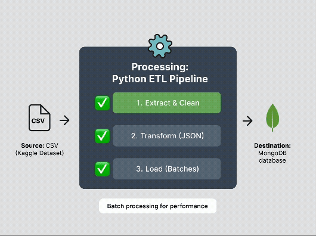
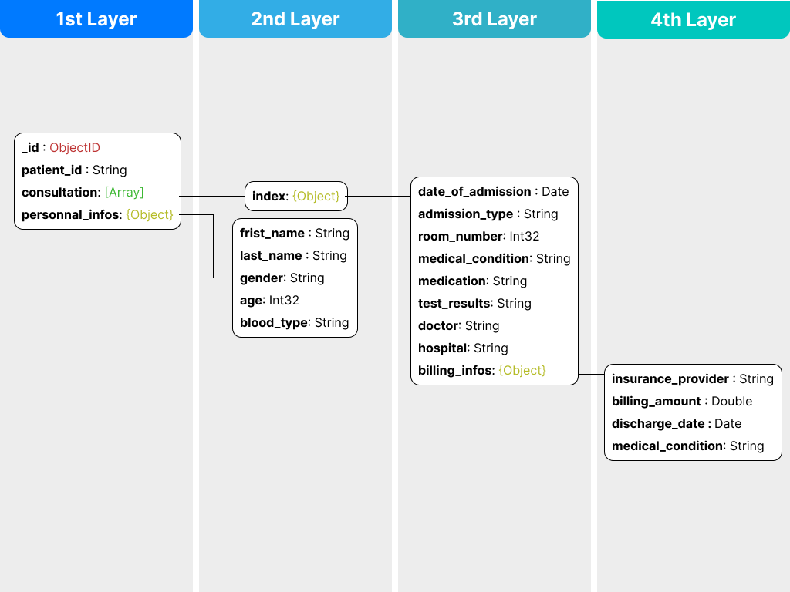

# 🚀🩺 Medical Data Migration (ETL)

[](https://www.python.org/)
[](https://www.mongodb.com/)
[](https://www.docker.com/)

Python ETL pipeline designed to extract, clean, and load healthcare data into **MongoDB**. 
Features Docker containerization for seamless deployment and modular Python structure for easy maintenance.

---

## 📖 Summary

- [Architecture](#-architecture)
- [Quick Start with Docker](#-quick-start-with-docker)
- [Key Features & ETL Logic](#-key-features--etl-logic)
- [Database Architecture](#-database-architecture)
- [Authentification Strategy](#-authification-strategy)
- [Tests](#-tests)

## 🏗 Architecture
- **Source:** CSV (Kaggle Healthcare Dataset)
- **Processing:** Python (Cleaning & Transformation)
- **Destination:** MongoDB

## 🛠 Quick Start with Docker

### Prerequisites
* [Docker](https://docs.docker.com/get-docker/) & [Docker Compose](https://docs.docker.com/compose/install/)
* Healthcare Dataset: [Download from Kaggle](https://www.kaggle.com/datasets/prasad22/healthcare-dataset)

### 1. Clone the repository
```bash
git clone git@github.com:NassimNaoui/migration_mongodb.git
cd migration_mongodb
```

### 2. Data Setup
Place the downloaded CSV file into the following directory:

> app/sample/data/healthcare_dataset.csv

### 3. Launch 
```bash
docker-compose up -d
```

### 🔧 Useful Commands
| Description | Command |
| :--- | :--- |
| View logs | `docker-compose logs -f` |
| Stop services | `docker-compose stop` |
| Remove containers and network | `docker-compose down` |
| Rebuild after code changes | `docker-compose up -d --build` |

## ✨ Key Features & ETL Logic
The pipeline follows a modular Extract, Transform, Load process to ensure data quality:

- ✅ Data Extraction: Efficiently reads the healthcare CSV dataset.

- ✅ Data Cleaning:

    - Deduplication: Identification and removal of duplicate records.
    - Name Normalization: Names are converted to uppercase, and titles (Mr, Mrs, Dr, etc.) are stripped.
    - Financial Formatting: The Billing Amount column is rounded.
    - Type Conversion: Date columns are parsed into proper datetime objects.
    - Unique Mapping: Generation of a unique key for each patient record.

- ✅ Loading: Transformation into JSON-like documents and batch insertion into MongoDB.

*Performance: The ETL process is designed to handle data in batches to optimize memory usage and speed up the migration.*



## 🏭 Database Architecture
The database follows a **document-oriented structure** (JSON-like) organized into 4 hierarchical layers. To ensure data integrity and minimize redundancy, the architecture is **patient-centric**:
- The Patient serves as the root document.
- All Consultations are stored within an array of objects nested under the patient.
- Each consultation contains specific metadata and clinical observations.



## 🔐 Authentification Strategy
To secure the medical data, we implement a multi-layer authentication strategy based on MongoDB best practices.

### 1. Enabling Authentification
By default, MongoDB does not enforce authentication. To activate it, you must create and modify the configuration file (mongod.conf) as follows:
```yaml
security:
    authorization:enabled
```

### 2. Principle of Least Privilege (POLP)
We strictly follow the **Principle of Least Privilege**, ensuring that users only have the access necessary to perform their specific tasks. Below are the recommended roles and scopes:

| Profil | Role | Scope |
| :--- | :--- | :--- |
| Administrator | userAdminAnyDatabase | Full system administration |
| Data Engineer | readWrite + dbAdmin | Staging and production databases |
| Data Analyst | read | Specific analytics databases |

### 3. User Creation Commands

#### 👑 Administrator 
```bash
use admin​
db.createUser({​
 user:"dba_admin",​
 pwd: passwordPrompt(),​
 roles: [​
  {role:"userAdminAnyDataBase", db:"admin"},​
  {role:"dbAdminAnyDataBase", db"admin"},​
  {role:"clusterAdmin", db:"admin"}, ​
 ]​
})​
```

#### ⚙️ Data Engineer
```bash
use admin​
db.createUser({​
 user:"data_engineer_etl",​
 pwd: passwordPrompt(),​
 roles: [​
  {role:"readWrite", db:"medical_db"},​
  {role:"dbAdmin", db"medical_db"},
 ]​
})​
```

#### 📊 Data Analyst
```bash
use admin​
db.createUser({​
 user:"data_analyst_01",​
 pwd: passwordPrompt(),​
 roles: [​
  {role:"read", db:"medical_db"}​
 ]​
})​​
```

## 🧪 Tests

Tests are written using **pytest**, including unit tests, integration tests, and data validation tests.

The goal is to validate each step of the ETL pipeline **before running the full process**.

⚠️ Note: The **Load tests use a mocked MongoDB**, so no real data will be affected.  
The **data validation tests**, however, must be executed **after data has been successfully loaded into a real MongoDB instance**.

### 🏃‍♂️ Running the tests

You can run tests step by step:

#### 1. Extract
```bash
pytest app/tests/test_extract.py
```

#### 2. Transform

``` bash
pytest app/tests/test_transform.py
```

#### 3. Load

``` bash
pytest app/tests/test_load.py
```

#### 4. Data validation

``` bash
pytest app/tests/test_data_validation.py
```

#### To run all at once 

``` bash
pytest app/tests
```
